# Amazon Vine Review Analysis

## Analysis Overview

This project analyzed Amazon product reviews to determine if bias exists among reviews that were part of the Vine program. Specifically, 5-star reviews were used as the metric by which to compare reviews that were part of the Vine program against those that were not part of the Vine program. PySpark was used in Google Colaboratory to perform the analysis, and the review data was pulled from Amazon AWS. Tool reviews were used for the analysis in this project, and the specific link is shown in the following section.

## Analysis Results

To begin the analysis, PySpark was initialized in Google Colaboratory, and a Spark session was started as shown in Figs. 1 and 2 below.

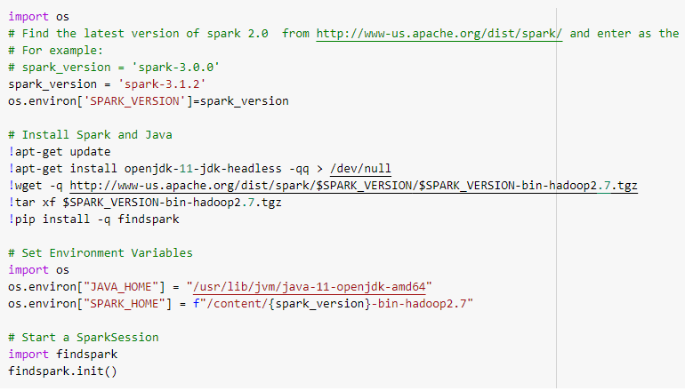

*Figure 1. PySpark initialization code in Google Colaboratory*

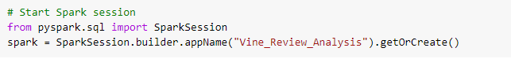

*Figure 2. Code to start Spark session*

In this analysis, Amazon review data for tools was imported, as shown in Fig. 3, and used to determine any bias due to the Vine program.

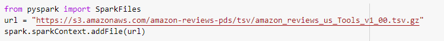

*Figure 3. Code to import Amazon review dataset*

The imported data was converted to a data frame as shown in Fig. 4, and a condensed data frame specific to this analysis was created according to Fig. 5.

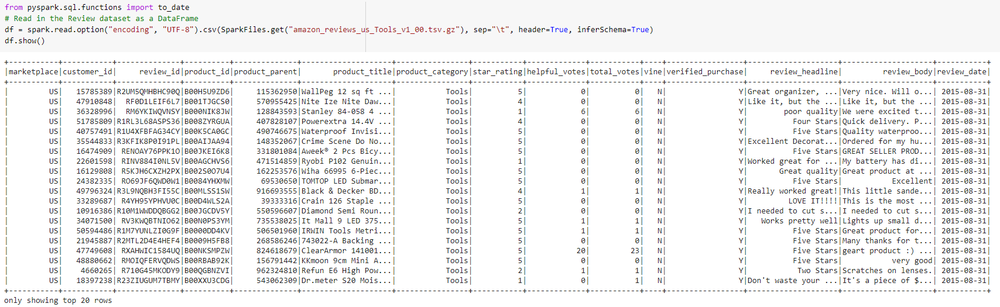

*Figure 4. Code to convert imported data to data frame and resulting data frame*

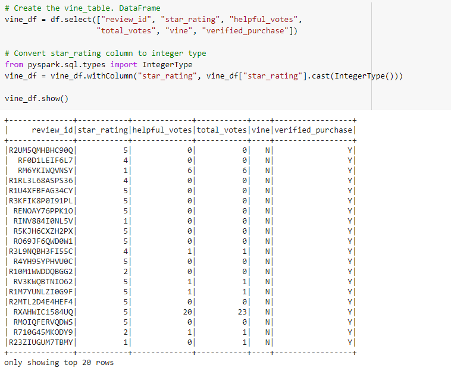

*Figure 5. Code to create condensed data frame specific to this analysis and resulting data frame*

From here, a new data frame was created that kept only reviews with 20 or more total votes to ensure that meaningful data was included in the analysis. Keeping a large number of item reviews that did not receive any votes could have skewed the results, and could have resulted in divide by zero errors for the next step. The code and new data frame are shown in Fig. 6.

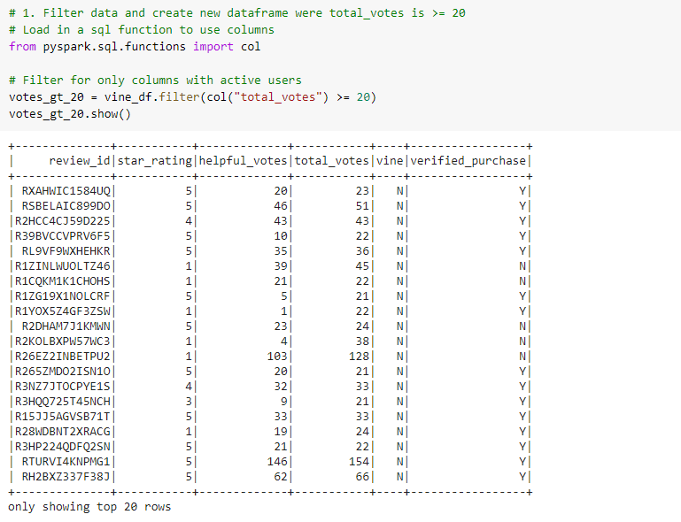

*Figure 6. Code to create new data frame that only keeps item reviews that had 20 or more votes and resulting data frame*

To further ensure that the most meaningful data was included in this analysis, a new data frame was created that filtered the data by the ratio of helpful reviews to total reviews. This data frame only kept reviews that had a ratio of helpful reviews to total reviews of 0.5 or greater. The code and data frame are shown in Fig. 7.

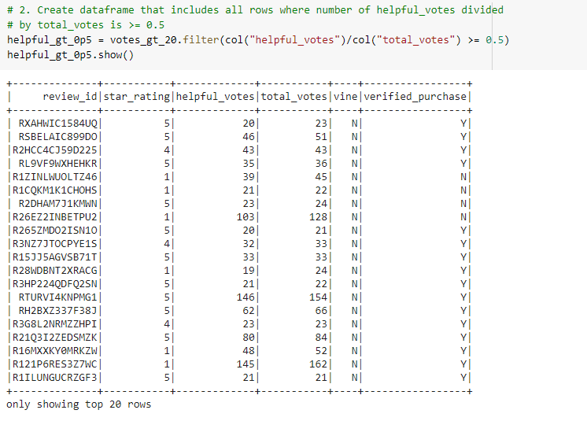

*Figure 7. Code to create new data frame that only keeps reviews where helpful_reviews/total_reviews is greater than or equal to 0.5 and resulting data frame*

The data was then segregated by paid Vine reviews and unpaid non-Vine reviews. The generation code and resulting data frames are shown in Figs. 8 and 9.

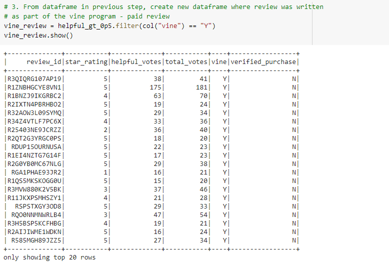

*Figure 8. Code to create new data frame that contains only paid reviews and resulting data frame*

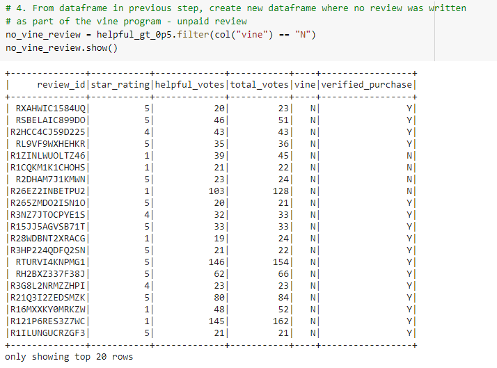

*Figure 9. Code to create new data frame that contains only unpaid reviews and resulting data frame*

To gain an understanding of whether or not bias exists among Vine reviews, the code in Fig. 10 was written to investigate the percentage of 5-star reviews for paid reviews vs. unpaid reviews. The results of this analysis are summarized in Fig. 11.

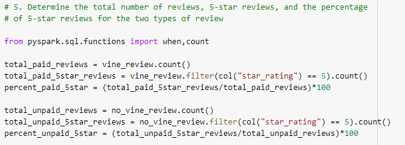

*Figure 10. Code to investigate the percentage of 5-star reviews for paid vs. unpaid reviews*

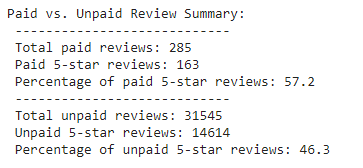

*Figure 11. Summary of total reviews, 5-star reviews, and percentage of 5-star reviews for paid vs. unpaid reviews*

To summarize the analysis results:

- There were a total of 285 paid (Vine) reviews and a total of 31,545 unpaid (non-Vine) reviews.
- Of the total Vine reviews, 163 were 5-star reviews. Of the total non-Vine reviews, 14,614 were 5-star reviews.
- Roughly 57% of the Vine reviews were 5-star reviews, and roughly 46% of the non-Vine reviews were 5-star reviews.

## Analysis Summary

Based on this analysis, it does appear that there could be some positivity bias among reviews in the Vine program. The 5-star review percentage was nearly 11% higher for paid reviews vs unpaid reviews. However, there was a significant difference in the total reviews for paid and unpaid reviews. It might be possible to achieve a better comparison by randomly sampling the same number of reviews from each dataset and computing the percentage of 5-star reviews from these sampled datasets. Further insight could also be gained by investigating the average star rating for paid reviews compared to unpaid reviews. If the total number of 5-star reviews and the average star rating were higher for paid reviews, one could reasonably conclude that there is positivity bias associated with reviews in the Vine program.

